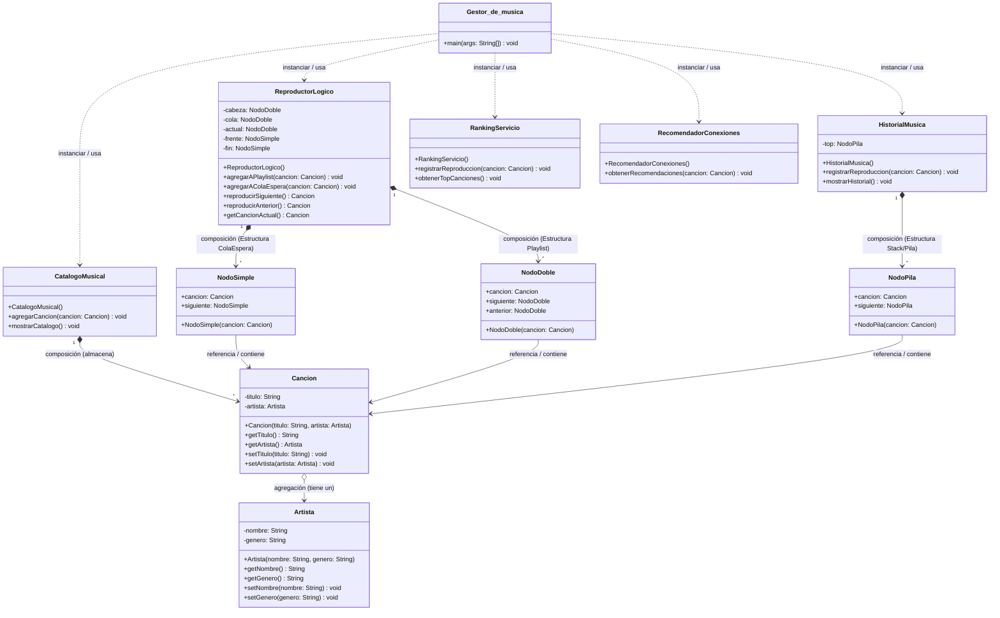
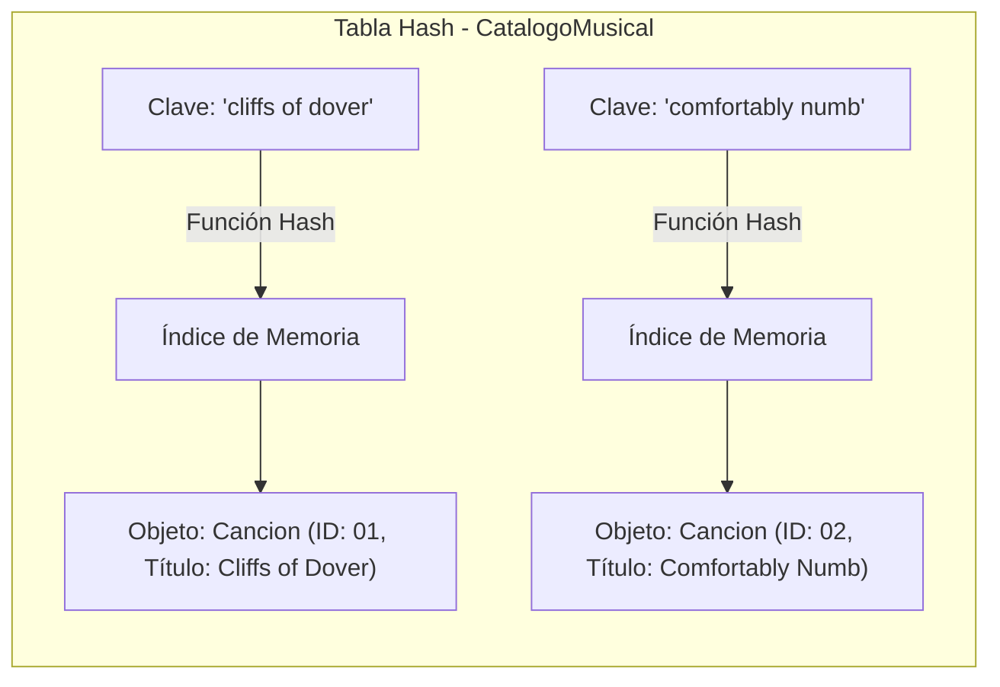
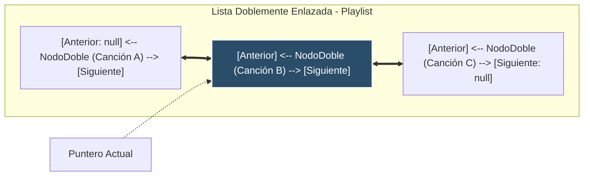
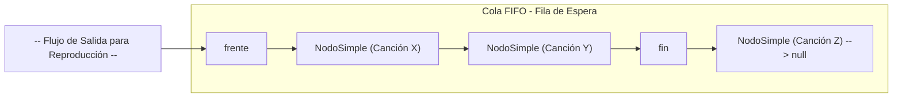
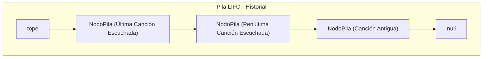
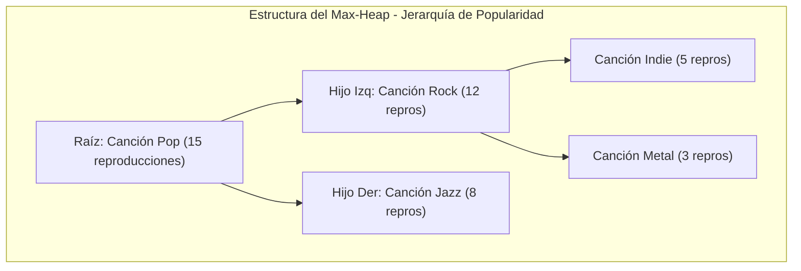
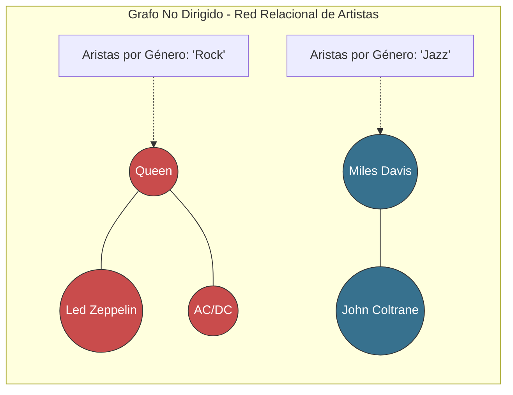
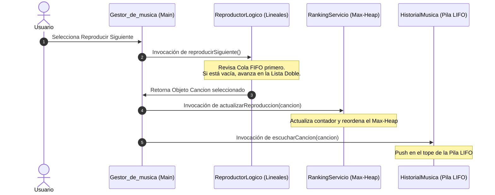

# Gestor de música
Un gestor de música hecho por estudiantes de la nacho

## Diagrama UML

---

## Desglose Técnico de las Estructuras de Datos

Este proyecto emplea un diseño modular donde cada estructura de datos fue seleccionada para resolver un problema algorítmico específico del dominio musical. A continuación, se explican las estructuras identificadas en el código:

### 1. Tabla Hash (CatalogoMusical)
* **Clase Asociada:** `CatalogoMusical`
* **Componente de Java:** `java.util.Map<String, Cancion>` instanciado a través de un `HashMap`.
* **Justificación de Elección:** Cuando un usuario introduce el nombre de una canción para añadirla a la fila de espera o buscar sus detalles, realizar una búsqueda lineal en una lista desorganizada degradaría el rendimiento. La Tabla Hash calcula el código hash del título de la canción, permitiendo indexar y recuperar el objeto en un **tiempo constante promedio de O(1)**.
* **Estrategia:** Las claves del mapa se almacenan siempre aplicando `.toLowerCase()`. Esto elimina la sensibilidad a las mayúsculas y minúsculas, garantizando que variaciones en la escritura apunten al mismo registro.

### 2. Estructuras Lineales Dinámicas (ReproductorLogico e HistorialMusica)
El sistema implementa tres tipos de estructuras lineales clásicas adaptadas a punteros explícitos mediante nodos internos:

#### A. Lista Doblemente Enlazada (Playlist Principal)
* **Ubicación:** `ReproductorLogico` (punteros `cabeza`, `cola`, `actual`) utilizando nodos `NodoDoble`.
* **Justificación:** Representa el orden secuencial por defecto de la biblioteca. Al contener enlaces hacia adelante (`siguiente`) y hacia atrás (`anterior`), faculta al reproductor a navegar de forma bidireccional sin tener que recalcular las posiciones desde la raíz de la lista. Costo algorítmico de **O(1)** en la transición de pistas.

#### B. Cola FIFO - First In, First Out (Fila de Espera)
* **Ubicación:** `ReproductorLogico` (punteros `frente`, `fin`) utilizando nodos `NodoSimple`.
* **Justificación:** Modela la opción de encolar canciones. Sigue el principio estricto de que la primera canción seleccionada de forma manual debe ser la primera en sonar, anteponiéndose al flujo de la playlist general. La inserción al final y extracción por el frente se procesan en **O(1)**.

#### C. Pila Dinámica LIFO - Last In, First Out (Historial)
* **Ubicación:** `HistorialMusica` (puntero `tope`) utilizando nodos `NodoPila`.
* **Justificación:** Almacena el rastro cronológico de las canciones reproducidas. Se realiza una operación **Push** en el `tope` de la pila en **O(1)**. Para mostrar el historial sin destruir la estructura original, se utiliza un puntero auxiliar que desciende nodo por nodo a través de las referencias `.abajo`.

### 3. Estructura No Lineal: Montículo de Máximos / Max-Heap (RankingServicio)
* **Clase Asociada:** `RankingServicio`
* **Componente de Java:** `java.util.PriorityQueue<Cancion>` configurado con comparador inverso por reproducciones.
* **Justificación de Elección:** El sistema requiere extraer ágilmente las 5 canciones con mayor popularidad. Un **Max-Heap** garantiza que el elemento raíz del árbol binario semiordenado contenga siempre el valor máximo absoluto.
* **Manejo de Mutaciones:** Cuando una canción es reproducida, su contador aumenta. Para no corromper el árbol, el sistema remueve la canción, incrementa el contador y la reinserta, desencadenando la flotación lógica de la estructura de forma segura en **O(log n)**.

### 4. Grafo No Dirigido por Lista de Adyacencia (RecomendadorConexiones)
* **Clase Asociada:** `RecomendadorConexiones`
* **Componente de Java:** `Map<Artista, List<Artista>> grafoArtistas` implementado con un `HashMap`.
* **Justificación de Elección:** Modela redes relacionales de afinidad artística. Al no existir una jerarquía lineal aplicable a las similitudes musicales, un Grafo es idóneo.
* **Construcción:** Se crea una arista bidireccional entre nodos (Artistas) si comparten el mismo género musical. Esto permite simular redes de recomendación con búsquedas de vecinos directos en relación con las conexiones del nodo visitado.

---

## Dinámica de Coherencia de Módulos

La principal virtud del proyecto es la interconexión sistémica. Cuando el usuario decide reproducir una canción, se desata una reacción en cadena que demuestra el uso simultáneo de las estructuras:

